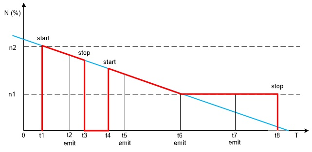

# The Emit Smart Contract

## Purpose of golos.emit smart contract
The smart contract `golos.emit` ensures the generation of new tokens and their distribution among reward pools in accordance with settings the parameters of the smart contract.  

## Overview
Tokens in the smart contract `golos.emit` are emitted according to the algorithm specified in the setting parameters. New tokens are distributed between the reward pools of such smart contracts as `golos.vesting`, `golos.publication`, `golos.ctrl` in accordance with the settings of the `golos.emit` smart contract parameters. Funds from the vesting pool are accrued to the owners of vesting party, from the publication pool — to the authors and curators of posts.  

## Parameters set in golos.emit smart-contract
The setting parameters have the following forms:  
```cpp
emit_param, types:[
    struct inflation_rate {
        uint16_t start,
        uint16_t stop,
        uint32_t narrowing
    },
    struct reward_pools {
        name name,
        uint16_t percent
    },
    struct emit_token {
        symbol symbol
    },
    struct emit_interval {
        uint16_t value
    },
]
```
**Parameters to be set:**  
  * `inflation_rate` — inflation parameters that determine the number of new tokens emitted for a certain period of time. Tokens that are already in circulation are not taken into account when calculating this indicator. The` inflation_rate` value is a structure containing the fields:
    * `start` — initial inflation rate;
    * `stop` — minimum inflation rate;
    * `narrowing` — the rate of decrease in the current percentage of inflation (shows the number of seconds during which the `start` parameter value decreases by 0.01%).
  * `reward_pools` — reward pool vector. For each pool, the parameter value has the form of a structure containing fields:
    * name — reward pool name;
    * percent —  the share (percentage) of new tokens that is transferred to the `name` pool. This value is set to an accuracy of 0.01 percent. This parameter takes the values from 0 to 10000. The value 10000 corresponds 100 %.
  * `emit_token` — the type of token that is being issued:
    * symbol — token symbol.
  * `emit_interval` — emission interval parameter:
    * value — new tokens emission interval (in seconds).  

New issued tokens are distributed among several pools. Award pools in which new tokens are distributed are determined by the witnesses. One of the reward pools must have zero percent. Remaining undistributed part of the tokens is transferred to this pool.  
 
When inflation is reduced to its minimum `stop` parameter, tokens continue to be emitted, but remain unchanged.  
 
> **Restrictions:**  
> The total percentage of all tokens distributed in pools must be no more than 100 (or 10 000 tokens). For example, 25 (pool of vesting) + 25 (pool of publications) + 49 (some other pool) + 0 (control pool) = 99 (%).  

## List of actions supported in golos.emit smart-contract
The `golos.emitl` smart contract supports the following actions: [setparams](#setparams), [validateprms](#validateprms), [start](#start), [stop](#stop) and [emit](#emit).  

## setparams
The `setparams` action is used to set the parameters of the smart contract (to configure the smart contract). The action has the following form:
```cpp
void emission::setparams(vector<emit_param> params)
```
`params` — a list of parameters to be set.  

## validateprms
The `validateprms` action is internal and called by the smart contract `golos.emit`. The action is used to check the parameters for validity, controls the presence of errors in them. The action has the following form:
```cpp
void emission::validateprms(vector<emit_param> params)
```
`params` — a list of parameters to be check.  

## start
The `start` action is used to start the emission process of tokens of a certain type in accordance with the selected algorithm.  
The action has the following form:
```cpp
void emission::start()
```
To perform this action it is required the authorization of `golos.emit` smart contract.  

The start time of emission is determined by the moment of the first call start. Before calling the `start` action, it is required to configure the smart contract parameters, as well as the reward pools.  
 
## stop
The `stop` action is used to temporarily or completely stop the token emission process, due to various reasons, including the need to change the parameters of the smart contract (for example, to reconfigure reward pools). The action has the following form:
```cpp
void emission::stop()
```
To perform this action it is required the authorization of `golos.emit` smart contract.  

## emit
The `emit` action is internal and its call is not available to a user. It is used to emit tokens in the amount determined by the selected algorithm. The action has the following form:
```cpp
void emission::emit()
```
The `emit` action is called periodically at regular intervals. Each call determines the amount of funds to accrue for each reward pool.  
Below is the diagram showing the emit of tokens by the `golos.emit` smart contract. This diagram also shows the moments of calling the actions `start`,` stop` and `emit`.  
 
  
 
Vertical axis shows the annual percentage of a certain type of tokens produced in relation to their total number of this type. Horizontally time is displayed. The blue line conventionally shows the annual inflation of tokens of this type. The red line conditionally indicates the percentage of tokens emitted by the smart contract relative to the total number of tokens of this type.  
 
Designations on the diagram in fig.1:
  * n1 is the minimum inflation rate, set by the `stop` parameter.
  * n2 is the initial rate of inflation, set by the `start` parameter.
  * t1 and t4 are the start times of the `start` action.
  * t3 and t8 are the start times of the `stop` action.
  * t2, t5, t6 and t7 are the instants of the launch time of the `emit` action.  
  
The diagram shows that the release of tokens began after the first start of the `start` action. Tokens emission stopped after the `stop` calls. When the threshold value n1 was reached, tokens emission remained at the minimum acceptable level. After the `emit` calls, the amount of tokens emission is displayed, which should be distributed among the award pools of smart contracts.  
**** 
